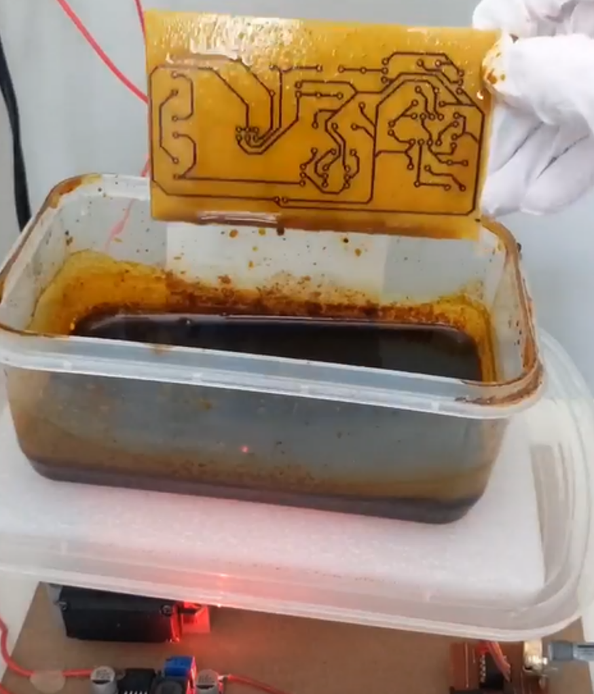

## PCB Pen Plotter Attachment

### [Watch the PCB Plotter in Action](https://youtube.com/shorts/HfE97TkYbKA)

### Check out my other projects that use the PCB Plotter for etching circuit boards:
1) [LiPo-Powered Analog LED Driver](https://github.com/furpectfox/LiPo-Powered_Analog_LED_Driver/blob/main/README.md)
2) [Solar-Charged Minecraft Fox Lamp](https://github.com/furpectfox/Solar-Charged_Minecraft_Fox_Lamp/blob/main/README.md)
3) [Fume Extractor](https://github.com/furpectfox/Fume_Extractor/blob/main/README.md)
4) [6 Ni-Cd Cells Charger](https://github.com/furpectfox/6V_Ni-Cd_Powered_Light/blob/main/README.md)

### Overview
This project is a 3D-printed pen plotter attachment designed to be mounted on the spindle motor of a CNC 3018 machine. Once mounted, the CNC machine can draw precise traces on copper-clad boards using a permanent marker. These traces act as a resist during the etching process, allowing you to create functional PCBs at home.

### Why I Built This
I’ve always wanted to etch my PCBs at home for quick prototyping or as a budget alternative to ordering from manufacturers like JLCPCB. My initial attempt with the photoresist etching method had a low success rate because I struggled to expose the photoresist layer under UV light for the right amount of time. I also found photoresist films and pre-applied copper clads to be a bit expensive.

I thought about the core principle of photoresist etching: It is bascically masking certain copper areas with an ink that resists the etching solution. So I try drawing traces on a bare copper clad by hand using a permanent marker — and it worked! The drawn areas protected the copper underneath during etching.

### Evolution of the Project
- **Improved Precision:** How can I automate the trace drawing process to make it much more precise? The answer: a 3D printer! So I designed a 3D-printed pen attachment that could be mounted to my 3D printer's head.
- **1st Problem - File Conversion Challenge:** The software I used to convert PCB layout (Carbide Create) only exported `.nc` files, which are meant for CNC machines. Since my 3D printer required `.gcode`, I wrote a simple [Python program](https://github.com/furpectfox/PCB_Trace_Plotter/blob/main/Code/nc_to_gcode%20Converter/main.py) to convert `.nc` files into `.gcode` files.
- **2nd Problem - Drilling:** All that's left to do is let the 3D printer draw the traces for me, then I can etch the PCB. However, there's another problem: I had to manually drill all the holes for the through-hole components, so I designed a [DIY drill press](https://github.com/furpectfox/PCB_Drill_Press). Even so, I still found the process too tedious. Then it occurred to me: I have a budget 3018 CNC machine. What if I use it to both draw the traces and drill the holes? So, I designed a new pen attachment for my CNC machine. This also means I no longer need to convert the `.nc` file to `.gcode`, since the CNC machine can use it directly.

### How It Works
1. **Mount the Pen Plotter:** Secure the 3D-printed pen attachment to your CNC 3018's spindle motor.
2. **Prepare the Design:** Create your PCB layout in your preferred software and export it as an `.nc` file.
3. **Plot the PCB:** Load the `.nc` file onto your CNC machine and let it draw the traces.
5. **Etch the Board:** Place the copper-clad board in an etching solution to reveal the drawn traces as copper circuits.

